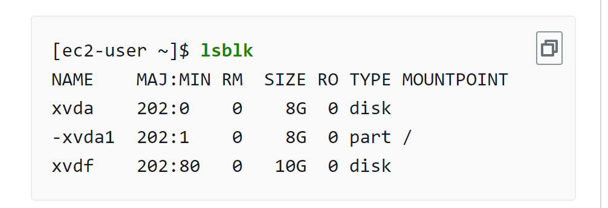
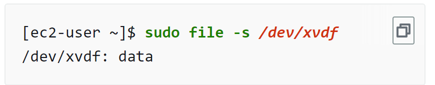

[](https://classroom.github.com/a/M_QhyY6W)
# Contents
- [Contents](#contents)
- [CMPE281 | Compute - EC2, AMIs, Elastic Block Storage, Autoscaling Groups](#cmpe281--compute---ec2-amis-elastic-block-storage-autoscaling-groups)
  - [Task 1 - Launch an EC2 Ubuntu Instance then Log In Using SSH and a key pair](#task-1---launch-an-ec2-ubuntu-instance-then-log-in-using-ssh-and-a-key-pair)
  - [Task 2 - Mount an EBS Volume and Decrease Instance Size](#task-2---mount-an-ebs-volume-and-decrease-instance-size)
  - [Task 3 - Setup User\_Data in Terraform to Automate Apache Setup](#task-3---setup-user_data-in-terraform-to-automate-apache-setup)
  - [Task 4 - Create an Auto Scaling Group in Terraform](#task-4---create-an-auto-scaling-group-in-terraform)
  - [Task 5 - Create an EBS Snapshot and Encrypt It](#task-5---create-an-ebs-snapshot-and-encrypt-it)
- [Deliverables](#deliverables)
  - [Terraform Files](#terraform-files)
  - [Screenshots](#screenshots)
  - [Questions](#questions)

# CMPE281 | Compute - EC2, AMIs, Elastic Block Storage, Autoscaling Groups

In today's lab, we will set up Apache on an EC2 server, mount an EBS volume, and create an autoscaling group (ASG) behind a load balancer. The starter repo has all the files and Terraform resources you'll need to complete this lab. But beware, the comment troll has ravaged the repository leaving functionality broken! Use your sleuthing skills to find out which pieces of code you need to uncomment to accomplish the task. It won't be easy towards the end. The nasty comment troll has eaten up some of your code as well. You'll have to consult the hashicorp Terraform docs to find out what values belong in the commented out files.

## Task 1 - Launch an EC2 Ubuntu Instance then Log In Using SSH and a key pair

Deploy the Terraform code in the repo by running 

```
terraform init && terraform plan
```

Review the plan, and consider how these resources are related. There are a lot of resources to keep track of, but there is an easy way to comprehend changes. Take a look at the resources name, e.g. 

```
aws_vpc_security_group_egress_rule.allow_all_traffic_ipv4
``` 

Note that there are periods used in this resource. To the right of the final period is the name of the resource. In this specific case, that would be `allow_all_traffic_ipv4`. To the left of the final period is the type of resource being created. Therefore, a resource of type `aws_vpc_security_group_egress_rule` named `allow_all_traffic_ipv4` is how you should interpret `aws_vpc_security_group_egress_rule.allow_all_traffic_ipv4`.


After you've reviewed the plan, apply the changes by running 

```
terraform apply
```


You should see an ip address in the output and a new key file in your directory that you can use to shell into your instance.

```
ssh -i key.pem ubuntu@<ip-address>
```

You might need to start your ssh agent. 

If you're on Windows and struggling to connect, take a look at this [guide](https://badetoye.medium.com/how-to-access-aws-ec2-instance-with-ssh-using-powershell-from-windows-os-77acb7011a8a).

Once you're logged in, it's time to spin up Apache.

```
sudo apt-get update
sudo apt-get install -y apache2
```

Is everything working? Egads! We're timing out. What could be the issue? Try to work your way through the networking.

Once you've resolved the issue, take a screenshot of your website.

## Task 2 - Mount an EBS Volume and Decrease Instance Size

We're probably going to be using these instances for a while over the course of the semester and it'll be a good idea to make sure we're using the smallest size possible. Change the instance size to `t2.nano` and uncomment the `ebs.tf` file. You might notice that our horrible fellow the comment troll has eaten up some code, so try to solve the missing values to attach your EBS volume to the instance we created in task 1. 

Once the EBS is attached, it should be visible when we run ```lsblk``` on our EC2 instance.

Try following the steps below or [this guide](https://docs.aws.amazon.com/ebs/latest/userguide/ebs-using-volumes.html) to setup the EBS volume.

If you attached it correctly, your output should look something like this.



If this is the first time you're using the block volume, you need to format it so it can be used as a file system. Running ```sudo file -s /dev/xvdf``` should output the following.


This shows us that the devices is still in a raw data format. Let's format the block volume to use an XFS file system by running 
```
sudo mkfs -t xfs /dev/xvdf
```

Once the block is formatted, running 
```
sudo file -s /dev/xvdf
```
should now show that our attached block volume is formatted as an XFS file system.

The next step is to mount the file system on a directory.

```
sudo mkdir /data && sudo mount /dev/xvdf /data
``` 

The above creates a directory named data in our root directory, then mounts the filesystem on that directory. Now, any data stored in `/data` will be stored on the EBS volume.

Let's test this out by storing a shell script on the EBS volume and running it when we start up the instance. 

From the lab repository, copy the contents of `install_apache.sh` and paste it into the a file on the instance.

You can do this by starting vim, (If you know how to use nano feel free to use it, I don't really care so long as it gets the job done.)

```
sudo vim /data/install_apache.sh
```

Vim has a bit of a learning curve, but the following information should be sufficient to get the job done. 

Vim has three modes of operation, NORMAL mode, INSERT mode, and VISUAL. Don't worry about VISUAL mode for now. Whenever you open vim, you will be in NORMAL mode. To write to the file, press the `i` key and you will switch to INSERT mode. Now you can paste your copied content. To save the file, you need to switch back to NORMAL mode by hitting the `esc` key. Type `:wq` to issue the commands write and quit (that's what :wq stands for). If you enjoy working with Linux and cloud, take some time to familiarize yourself with vim. It is a powerful text editor for Linux distros and will be very handy in your career as a DevOps engineer. 

Once it's saved, you'll have to edit the permissions to make it executable,
```
sudo chmod 755 /data/install_apache.sh
```

Test the script by running it and verifying that your instance is now accessible through IP address in browser or through curl:
```
curl <ip-address>
```


## Task 3 - Setup User_Data in Terraform to Automate Apache Setup
   
Now that the EBS volume is setup, we want to test that new instances can automatically access the persistent files. 

First, we need to destroy our instance and ebs attachment, but not the ebs volume. to do this, we do 
```
terraform destroy --target aws_instance.app_server
```

Next, in the `aws_instance` resource, uncomment the `user_data` line. This line passes a shell script which will run when the instance is initiated. Observe in the shell script how we create the `/data` directory and mount the EBS to it, then run our stored script. These lines will execute when the instance is created.


Now, we will recreate the aws_instance while passing in the script through user data.
```
terraform apply
```
You should see in the new instance being created, there is user data attribute being set. This verifies that our file is being passed in. If all is done correctly, we should be able to curl our ip address and see the hello message from our script.

```
curl <ip-address>
```


## Task 4 - Create an Auto Scaling Group in Terraform 

For this task, you will need to uncomment the `asg.tf` file and fill out the correct values. Get comfortable with finding the right docs on your own. Look up the resource online, the official documents managed by hashicorp are hosted on `registry.terraform.io`. 

Note that you do not need to add any lines to the files, just find correct values which will suffice for the missing assignments, e.g., `availability_zones = ["us-west-1a"]`.

Uncomment all three resources and pass in correct values for each input.

To test if your values are correct, go to the console, and find the elastic load balancer in EC2. If everything was done correctly, clicking on the dns link to the ELB should show you welcome page. 

Some things to note:
1. ASG doesn't use EBS, so the user data won't be the same as before.
2. The health check target needs to match the protocol we're using (HTTP), and the port our website is serving (80).
3. Part of the objective of this task is to build your comfortability with solving problems independently. Try to limit validating questions (e.g., "Have I done this right?") until you've reached the final step and can see your instance ID and IP address at the ELB URL. A good time to reach out is if you're stuck for 10 minutes and have tried 2 different approaches. 

## Task 5 - Create an EBS Snapshot and Encrypt It

The EBS volume we created was unencrypted. This usually goes against most corporate compliance protocols for company or user data. So there will be some cases that an unencrypted EBS volume needs to be updated to an encrypted volume. Do the research either online or in the required reading for this week on how to encrypt an existing EBS volume.

Once you've done it, take a screenshot of your encrypted volume.

# Deliverables

## Terraform Files

1. `ec2.tf`
2. `ebs.tf`
3. `asg.tf`
4. `sg.tf`

## Screenshots
Place the following screenshots in the `/deliverables/screenshots` directory and include them in the `deliverables/README.md` 

1. Screenshot of welcome page and ip address in browser
2. Screenshot of formatted EBS volume
3. Screenshot of ASG in console
4. Screenshot of welcome page and ip address with ELB endpoint
5. Screenshot of encrypted EBS snapshot

## Questions
Answer the following questions in the `deliverables/README.md` file.

1. Imagine that your application will need to run two always-on `f1.2xlarge` instances (which come with instance storage and won't require any EBS volumes). To meet seasonal demand, you can expect to require as many as four more instances for a total of 100 hours through the course of a single year. What combination of instance types should you use? Calculate your total estimated monthly and annual costs.

2. What are some benefits to using an Elastic Load Balancer and an Auto Scaling Group? What are some cons?

3. What's the difference between a launch template and a launch configuration?

4. What's the purpose of a security group? 

5. What's the method to convert an existing unencrypted EBS volume to an encrypted EBS volume? (optional)


